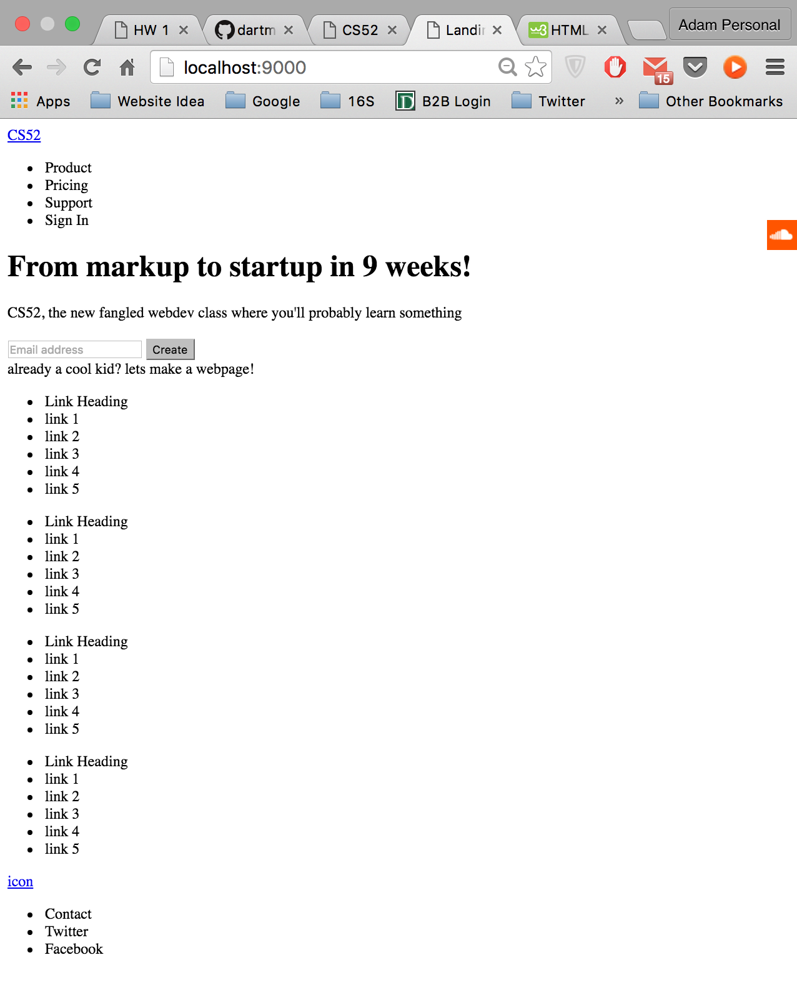
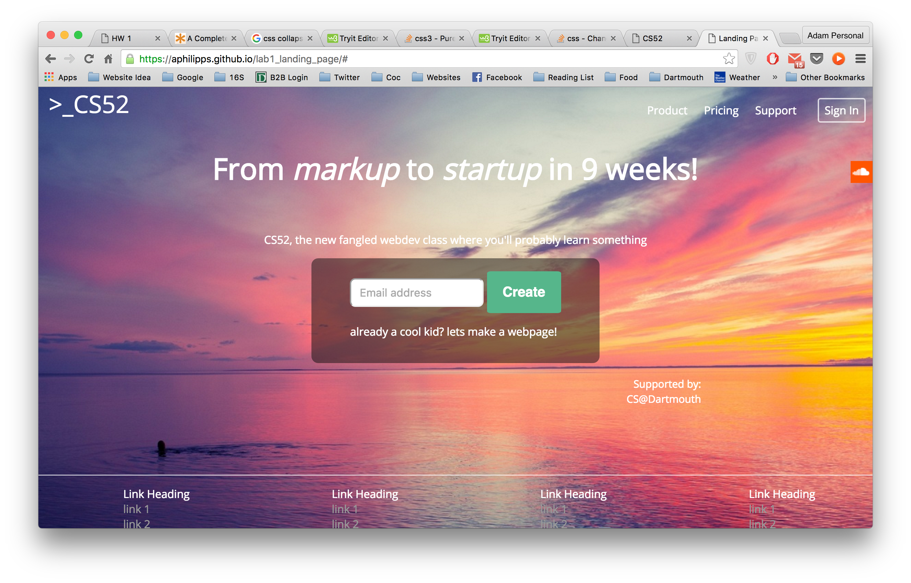
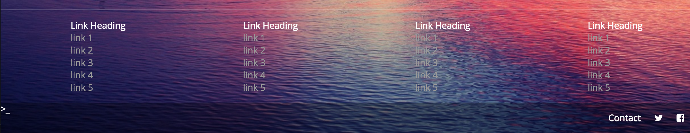
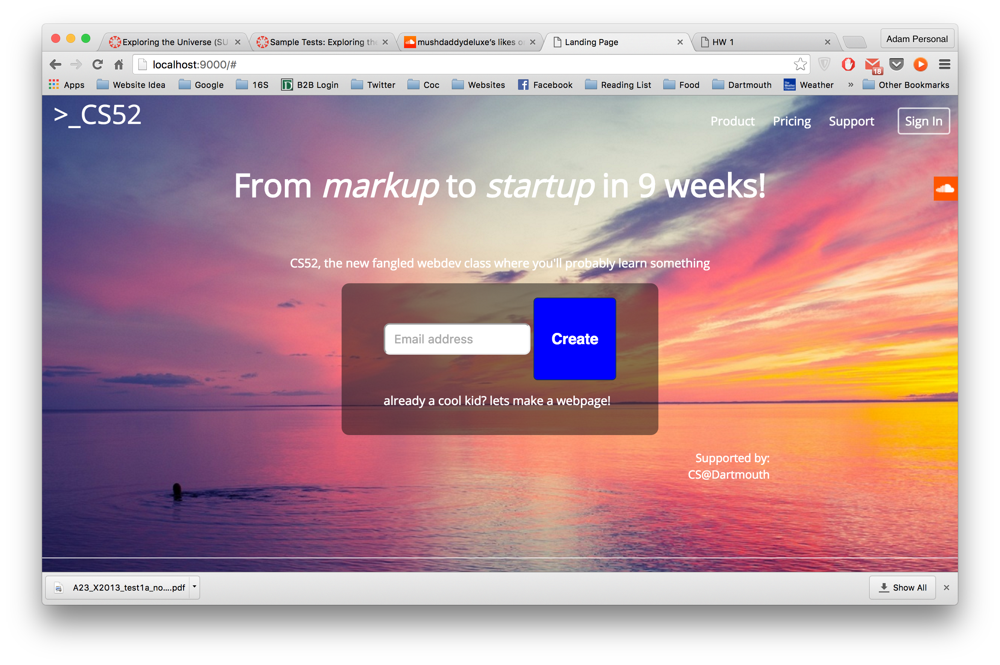
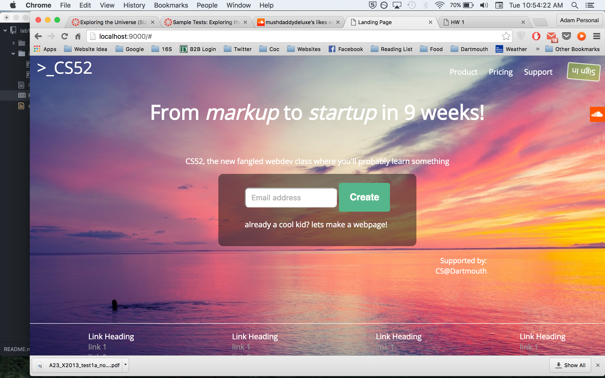
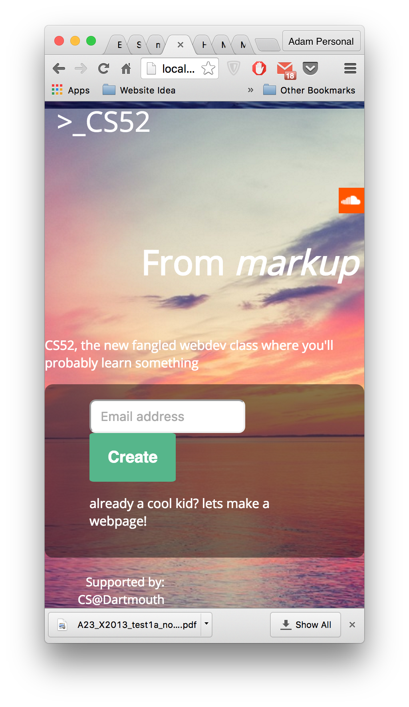
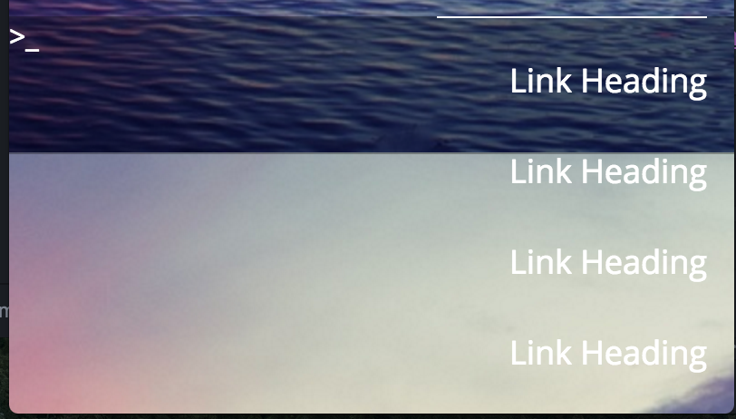

# lab1_landing_page

1. What worked/what didn't.

I didn't feel like I had too much difficulty creating the base website for a desktop screen, but had more difficulty when trying to scale the webpage for a smaller window size. Another thing that I though was somewhat difficult was keeping my css organized because it doesn't matter what order most items appear in within style.css.

## Layout Stage

## Webpage

## Bottom

## Transition 1
Create button grows and changes color on hover

## Transition 2
Sign in button spins and changes color on hover

## Smaller Window Size

## Smaller Bottom

